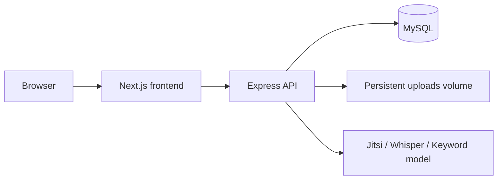

# Deployment Guide

**Last verified:** June 30, 2026

Production deployment guide for Archivum. This document focuses on the **API backend** (Express + MySQL). The Next.js frontend is typically deployed separately (e.g. Vercel, Railway, or another Node host).

For local development, see [SETUP.md](./SETUP.md). For Docker-based local parity, see [DOCKER.md](./DOCKER.md).

Detailed Railway-specific steps also exist at [.github/instructions/railway-deployment.instructions.md](../.github/instructions/railway-deployment.instructions.md).

---

## Architecture overview



| Component | Responsibility |
|-----------|----------------|
| Frontend | Serves UI; calls API via `NEXT_PUBLIC_API_URL` |
| API | Auth, business logic, file uploads, static `/uploads` |
| MySQL | Primary data store |
| Volume | Persistent disk for avatars and documents |

---

## Pre-deployment checklist

### API start script

The API uses:

```json
"start": "node scripts/run-migrations.js && node src/server.js"
```

Migrations run automatically on start. Railway and similar platforms invoke `npm start` by default.

### Port binding

`src/server.js` reads `process.env.PORT`. Hosting platforms inject this automatically — do not hardcode the port.

### Node version

Require Node.js 20+ via `package.json`:

```json
"engines": { "node": ">=20.0.0" }
```

### Required environment variables

| Variable | Purpose |
|----------|---------|
| `NODE_ENV` | Set to `production` |
| `DB_HOST`, `DB_PORT`, `DB_NAME`, `DB_USER`, `DB_PASSWORD` | MySQL connection |
| `JWT_SECRET` | Session signing key (32+ random characters in production) |
| `WEB_ORIGIN` / `CLIENT_URL` | Deployed frontend URL |
| `CORS_ORIGINS` | Comma-separated allowed browser origins |
| `API_ORIGIN` | Public API URL |
| `UPLOAD_PATH` | Persistent upload directory (see below) |

Optional but recommended for full features:

| Variable | Purpose |
|----------|---------|
| `SMTP_*` | Email verification and password reset |
| `GOOGLE_CLIENT_ID`, `GOOGLE_CLIENT_SECRET` | Google OAuth |
| `JITSI_BASE_URL` | Video meetings |
| `KEYWORD_MODEL_URL` | Related studies search |
| `TRANSCRIPTION_MODEL_URL` | Audio transcription |
| `TRUST_PROXY` | Set `true` behind Railway/nginx reverse proxy |

See [.env.example](../.env.example) for the full list.

---

## Persistent file uploads

Railway and similar platforms use **ephemeral filesystems** — files written to disk are lost on redeploy unless stored on a persistent volume.

The API already supports `UPLOAD_PATH` via [config/env.js](../config/env.js). When set, avatars and documents are stored under that path and served from `/uploads/*`.

### Railway volume setup

1. Open the API service in Railway → **Settings → Volumes → Add Volume**.
2. Mount path: `/mnt/uploads` (or your chosen path).
3. Set environment variable: `UPLOAD_PATH=/mnt/uploads`.
4. Redeploy and verify uploads survive a restart.

Local development falls back to `./uploads` when `UPLOAD_PATH` is unset.

---

## CORS configuration

The API reads allowed origins from `CORS_ORIGINS`, `CLIENT_URL`, and `WEB_ORIGIN` ([config/env.js](../config/env.js)). In production, set:

```env
CORS_ORIGINS=https://your-frontend.example.com
WEB_ORIGIN=https://your-frontend.example.com
CLIENT_URL=https://your-frontend.example.com
```

The frontend must set:

```env
NEXT_PUBLIC_API_URL=https://your-api.example.com/api
```

---

## Database

### MySQL provisioning

Use Railway MySQL, PlanetScale, AWS RDS, or another MySQL 8 provider. Copy connection variables into the API environment.

### Migrations

Migrations in [migrations/](../migrations/) run via `npm run migrate` or automatically on `npm start`.

For first deploy on a fresh database:

```bash
npm run migrate
```

Or rely on the start script if migrations are idempotent (they are designed to be).

---

## Railway deployment (API)

1. **New Project → Deploy from GitHub** → select `research-pipeline-api`.
2. **Add MySQL** plugin or connect external database; copy `DB_*` variables.
3. **Add Volume** and set `UPLOAD_PATH` (see above).
4. **Set variables** from the checklist section.
5. **Deploy** — watch logs for:
   - Database connection success
   - Server listening on `PORT`
   - No `ENOENT`/`EACCES` on upload path (volume misconfiguration)

### Frontend on Railway (optional)

Deploy `research-pipeline-web` as a separate service:

```env
NEXT_PUBLIC_API_URL=https://your-api.up.railway.app/api
```

Ensure the API `CORS_ORIGINS` includes the frontend URL.

---

## Production security

- Never set `ALLOW_DEV_AUTH_BYPASS=true` in production.
- Use a strong `JWT_SECRET` (32+ characters).
- Enable HTTPS on both frontend and API.
- Set `TRUST_PROXY=true` when behind a reverse proxy.
- Restrict database access to the API service only.

---

## Post-deploy verification

1. `GET https://your-api.example.com/health` → `{ "status": "ok" }`
2. Register or log in via the frontend.
3. Upload a document and confirm it persists after API restart.
4. Verify role-based dashboard redirect works.
5. If using optional services, confirm Jitsi/transcription/keyword URLs are reachable from the API container.

---

## Troubleshooting

| Symptom | Likely cause |
|---------|--------------|
| CORS errors | `CORS_ORIGINS` missing frontend URL |
| 401 on all requests | `JWT_SECRET` changed between deploys; users must re-login |
| Uploads disappear after redeploy | `UPLOAD_PATH` not on persistent volume |
| DB connection refused | Wrong `DB_HOST`/`DB_PORT`; DB not reachable from API network |
| Migrations fail | DB user lacks CREATE/ALTER privileges |

---

## Quick checklist before every deploy

- [ ] `UPLOAD_PATH` on persistent volume
- [ ] All `DB_*` variables set
- [ ] `JWT_SECRET` set (strong, unchanged unless intentional rotation)
- [ ] `CORS_ORIGINS` / `WEB_ORIGIN` match deployed frontend
- [ ] `NEXT_PUBLIC_API_URL` on frontend points to API
- [ ] Migrations applied on target database
- [ ] Optional services configured if features are required
